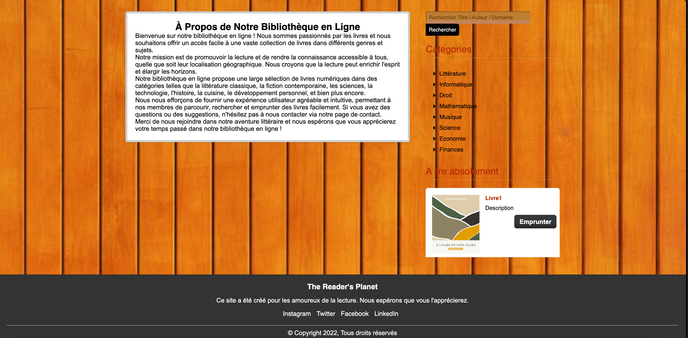

# Library Management

C'est un projet de gestion d'une bibliothèque virtuelle.

# Features

- User Registration
- User Login
- Add Books
- Delete Books
- Update Book Information
- Search Books
- Borrow Books
- Return Books

## Technologies Used

- PHP
- MySQL
- HTML
- CSS
- JavaScript

-
-
-

